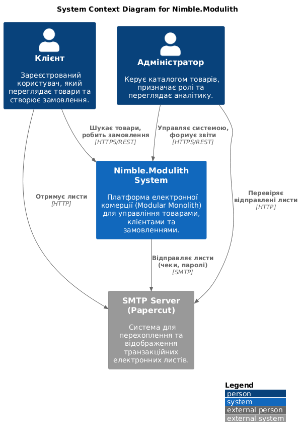
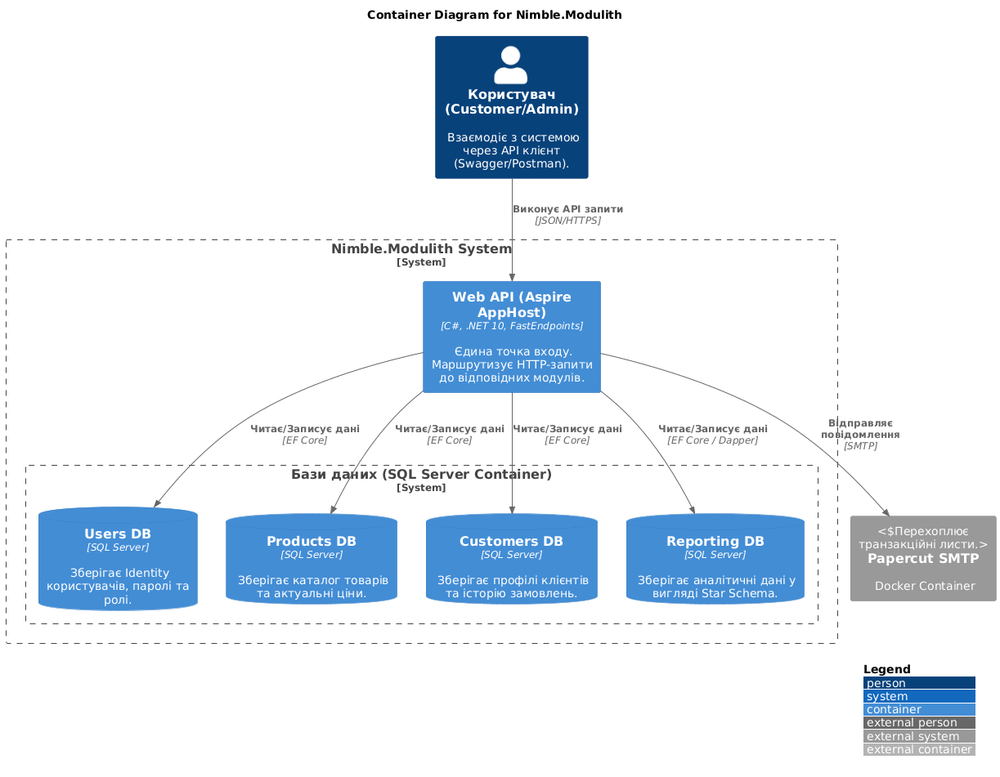
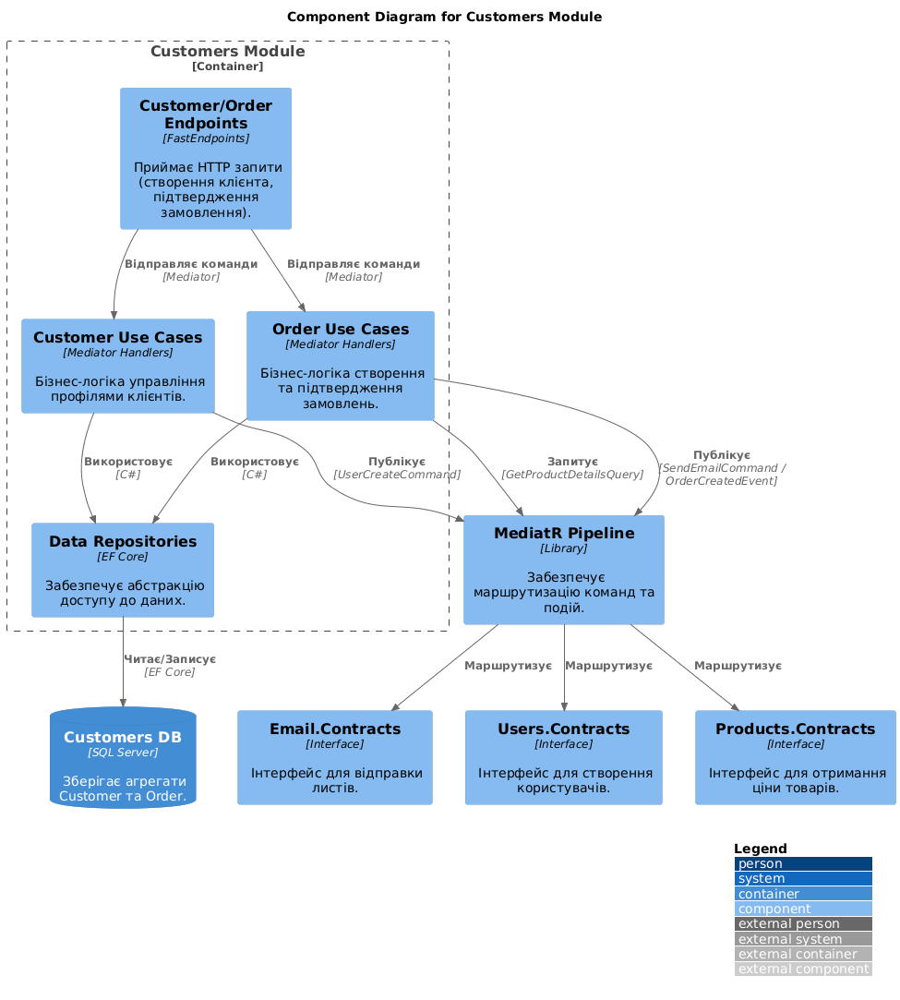

# Nimble.Modulith

**Nimble.Modulith** — це [демонстраційний лабораторний проект](https://github.com/NimblePros/ModularMonolithWorkshop), що ілюструє побудову архітектури **Modular Monolith** на платформі .NET 10.

Проект розділений на ізольовані, слабо пов'язані модулі, кожен з яких відповідає за певну бізнес-доменну область, має власну базу даних (або схему) та комунікує з іншими частинами системи виключно через чітко визначені контракти та події.

---

## Стек технологій та патернів

- **Framework:** .NET 10
- **Orchestration:** [.NET Aspire](https://learn.microsoft.com/en-us/dotnet/aspire/)
- **API Architecture:** [FastEndpoints](https://fast-endpoints.com//) (реалізація патерну REPR — Request-Endpoint-Response)
- **Міжмодульна комунікація:**
  - **Синхронна:** `Mediator` (Source Generated) для внутрішніх запитів (наприклад, отримання ціни з модуля Products).
  - **Асинхронна (Event-Driven):** Domain/Integration Events для публікації подій (наприклад, сповіщення про створення замовлення).
- **Робота з даними:**
  - **Entity Framework Core:** з підтримкою Resilience/Retry політик.
  - **Dapper:** для високоефективних аналітичних запитів.
  - **MS SQL Server:** як база даних.

---

## Структура модулів

Система складається з п'яти незалежних бізнес-модулів:

1.  **Users Module:** Керування користувачами, JWT-автентифікація, автоматична генерація тимчасових паролів та їх скидання.
2.  **Products Module:** Каталог товарів, управління номенклатурою та ціноутворенням.
3.  **Customers Module:** Профілі клієнтів та повний життєвий цикл замовлень (від створення до підтвердження).
4.  **Email Module:** Фонова асинхронна відправка транзакційних листів (Welcome-листи, чеки, відновлення пароля) через `Channel<T>` та `BackgroundService`.
5.  **Reporting Module:** Модуль аналітики, що будується на основі подій. Використовує Star Schema та підтримує експорт звітів у форматах JSON та CSV.

---

## Архітектурні рішення

### Фізичне розділення на Contracts та Implementation
Проект реалізує принцип суворої інкапсуляції шляхом розділення кожного модуля на два окремі проекти:
* **Module.Contracts:** Публічний інтерфейс модуля. Містить лише описи команд (Commands), запитів (Queries), подій (Integration Events) та об'єктів передачі даних (DTO). Це єдиний проект, на який можуть посилатися інші модулі.
* **Module.Implementation:** Приватна частина, що містить бізнес-логіку, сутності бази даних, налаштування EF Core та кінцеві точки API. Такий підхід унеможливлює випадкове використання внутрішніх деталей реалізації одного модуля іншим, забезпечуючи високу якість коду та легкість підтримки.

### Автономність даних та ізоляція схем
Кожен модуль володіє власними даними, що реалізовано через наступні механізми:
* **Окремі контексти БД:** Кожен модуль має власний `DbContext`, обмежений лише його таблицями.
* **Логічна ізоляція:** На рівні SQL Server використовуються окремі схеми (`Users`, `Products`, `Customers`, `Reporting`).
* **Заборона крос-модульних JOIN-запитів:** Пряме звернення до таблиць іншого модуля заборонено на рівні архітектури. Якщо модулю потрібні дані з іншої області, він отримує їх через запити Mediator або шляхом синхронізації через події.

### Асинхронна обробка через черги (Producer-Consumer)
Для операцій, що не потребують миттєвого результату (наприклад, відправка Email), застосовано патерн Producer-Consumer:
* **Non-blocking API:** Ендпоінт лише додає повідомлення в пам'ятну чергу `Channel<T>` і миттєво повертає відповідь користувачу.
* **Resilience:** Фоновий воркер (`BackgroundService`) поступово обробляє чергу. Це захищає систему від затримок або відмов зовнішніх SMTP-серверів, підвищуючи загальну стійкість додатка.

### Аналітичне моделювання та Star Schema (CQRS/OLAP)
Модуль звітності реалізований за принципами розділення відповідальності між читанням та записом:
* **Спеціалізована структура:** Замість нормалізованих транзакційних таблиць використовується класична "Зірка" (Star Schema). Вона складається з денормалізованих таблиць вимірів (`DimDate`, `DimCustomer`, `DimProduct`) та центральної таблиці фактів (`FactOrders`).
* **Продуктивність:** Для вибірки даних використовується **Dapper**, що дозволяє виконувати складні аналітичні SQL-запити з мінімальними накладними витратами, характерними для важких ORM.
* **Event Ingestion:** Дані в аналітичне сховище потрапляють через обробку події `OrderCreatedEvent`, що забезпечує повну декупеляцію (відсутність зв'язків) між операційним модулем Customers та аналітичним модулем Reporting.

---

**Основні переваги такої архітектури:**
1.  **Масштабованість:** Модулі можуть бути винесені в окремі мікросервіси з мінімальними змінами в коді.
2.  **Тестованість:** Чіткі межі дозволяють ізольовано тестувати бізнес-логіку кожного модуля.
3.  **Паралельна розробка:** Розробники можуть працювати над різними модулями одночасно, не створюючи конфліктів у коді та базах даних.

## Архітектурні діаграми

_Нижче наведені схеми архітектури на основі моделі C4:_

### System Context

)

### Container



### Component



---

## Інструкція з розгортання

### Попередні вимоги

- [.NET 10 SDK](https://dotnet.microsoft.com/download/dotnet/10.0)
- [Docker Desktop](https://www.docker.com/products/docker-desktop/) (запущений)

### Запуск проекту

1.  Клонуйте репозиторій:
    ```bash
    git clone https://github.com/TeseySTD/practicum-2-4-Enterprise-Arch-
    cd practicum-2-4-Enterprise-Arch
    ```
2.  Виконайте збірку рішення:
    ```bash
    dotnet build
    ```
3.  Запустіть проект через Aspire AppHost:
    ```bash
    dotnet run --project Nimble.Modulith.AppHost/Nimble.Modulith.AppHost.csproj
    ```
4.  У консолі з'явиться посилання на **Aspire Dashboard** (зазвичай `https://localhost:17188`). Там ви знайдете посилання на:
    - **webapi (Endpoint):** Swagger UI для тестування API.
    - **papercut (Endpoint):** Локальний веб-інтерфейс (порт `37408`) для перегляду всіх відправлених системою email-листів.

---
